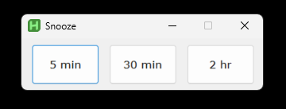
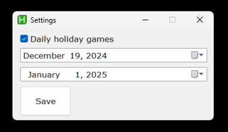

# Epic Games Claimer

AutoHotkey script to quickly and automatically claim Epic Games weekly free games.

Every friday (1 day after free game is released), or every day during winter holidays, the script will popup a window allowing you to activate it and claim the free game for you.

## Features

- Simple interface with one button activation

- Snooze

- Holiday daily games settings

## Setup

> [!NOTE]
> This script was made for a laptop screen and will need to be modified to work on a larger monitor

1. Clone repo
2. Create a shortcut in the Windows `Startup Folder` pointing to `epic_games_claimer.ahk`
3. (optional) Configure the settings for daily holiday games
